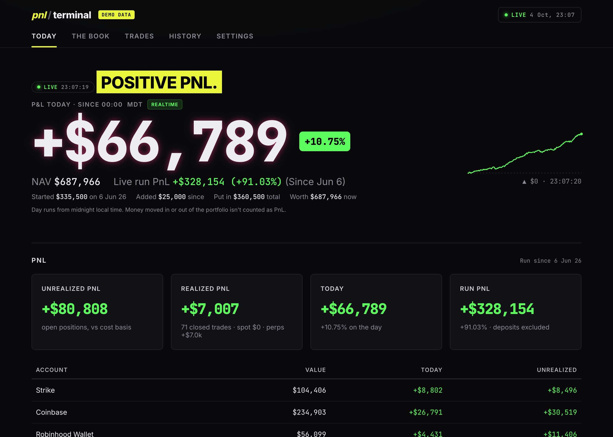
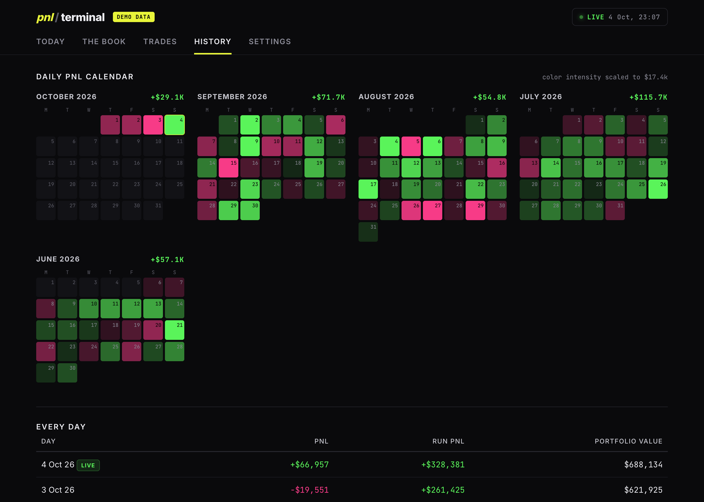

# PnL Terminal

A live, self-hosted PnL dashboard for everything you trade: exchanges, brokers and self-custody wallets in one view. It shows today's PnL in real time, plus streaks, a daily PnL calendar, win rate, realized and unrealized PnL, and every position across every venue.

It runs **only on your computer**. There's no account to sign up for and no server in the middle. Your API keys never leave your machine except to call the venue they belong to.



<details><summary>Daily PnL calendar</summary>



</details>

## Quick start

You need **[Node.js 22.9 or newer](https://nodejs.org)**. Nothing else: there are no dependencies to install.

```bash
git clone https://github.com/YOUR-USERNAME/pnl-terminal.git
cd pnl-terminal
npm start
```

Your browser opens at **http://localhost:4200** with a setup screen:

1. Click **Add account** and pick a venue.
2. Follow the steps shown for it (where to get the key and which permission to choose), then paste the key or wallet address.
3. Click **Test connection**. You'll see your balance if it worked.
4. Click **Save & start tracking**.

You can add, edit or remove accounts anytime from **Accounts & keys** at the top of the page.

Just want to look around first? Run `npm run demo` for fake data.

## Supported accounts

| Account | What you need | Live balances | Trade history |
|---|---|---|---|
| **Coinbase** | A CDP API key with **View** permission only | ✓ spot, perps, futures | `Import past trades` (app buys, sells, converts, deposits) |
| **Strike** | An API key with the balance-read scope only | ✓ BTC + USD | CSV export → Settings → Import a CSV |
| **Hyperliquid** | Your wallet address (no key) | ✓ perps + spot | ✓ full fill history + daily PnL |
| **Crypto wallets** | Public addresses: EVM, Solana, Bitcoin | ✓ Ethereum, Base, Arbitrum, Optimism, Polygon, BNB Chain, Robinhood Chain, Solana, Bitcoin | ✓ Solana txs, listed EVM tokens, cross-chain swaps via Relay |
| **Charles Schwab** | A Schwab developer app (Trader API), or type holdings in | ✓ stocks + options | — |
| **Manual holdings** | Nothing: type ticker + quantity | ✓ priced live (stocks via Yahoo, crypto via Coinbase) | — |

**Never paste a seed phrase or private wallet key.** Nothing here needs one. Exchange keys only need read/view permission. Don't give them trade or withdraw access.

## Keeping it running

PnL history builds up while the app runs. Days it was off land on the next day it runs.

**macOS:** install it as a login service so it records in the background:

```bash
./scripts/autostart.sh install     # start now and at every login
./scripts/autostart.sh logs        # watch the log
./scripts/autostart.sh uninstall   # stop and remove
```

**Linux/Windows:** run `npm start` in a terminal, or use your usual process manager (systemd, pm2, Task Scheduler).

## Past history

After connecting, the setup screen offers **Import past trades** (also under Settings → History):

- **Backfill** pulls trade history from Coinbase, your wallets and Hyperliquid. It's safe to re-run.
- **Rebuild daily history** estimates each day's close before you started tracking, replaying every account's transactions at that day's prices. Rebuilt days show dashed in the calendar.

Or from a terminal:

```bash
npm run backfill
npm run rebuild
npm run import -- strike ~/Downloads/strike.csv          # dry run; add --write to save
```

## How PnL is counted

- **Today's PnL** = change in total value − money moved in or out of the portfolio. Coinbase deposits are detected automatically; log anything else under Settings → Log a deposit / withdrawal. Moves between your own accounts net out by themselves.
- **Unrealized** = open positions vs cost basis: the venue's average price, else a cost-basis override (Accounts & keys → General), else FIFO lots rebuilt from your trades.
- **Realized / win rate** = closed round trips since your history start date, across every venue. A position is closed when it's sold back to under 2% of its peak size.
- When you add a new account, address or token, its current value counts as a deposit, not as profit.

## Where things live

| File | What's in it | In git? |
|---|---|---|
| `.env` | Your API keys (written by the setup screen, file mode 600) | **No** |
| `accounts.json` | Your accounts, addresses and preferences | **No** |
| `data/pnl.db` | Your history (SQLite) | **No** |
| `.env.example`, `accounts.example.json` | Templates if you'd rather edit by hand | Yes |

The server listens on `127.0.0.1` only and refuses requests from other websites, so nothing on your network or the web can read your data or change your keys.

Set `PORT=4300` in `.env` to use a different port.

## Editing config by hand

Everything the setup screen does is plain files, so you can also copy `accounts.example.json` → `accounts.json` and `.env.example` → `.env` and edit them. Restart the app afterwards. Extra options:

| Key | What it does |
|---|---|
| `timezone` | When your trading day rolls over |
| `historyStart` | Where streaks, win rate and the calendar start |
| `tradesFrom` | How far back trades are pulled for cost basis |
| `costBasis` | Average-price overrides, e.g. `{ "BTC": 60000 }` |
| `dustUsd` | Hide wallet balances worth less than this (default 1) |
| `excludeCash` (Coinbase) | Leave Coinbase USD/USDC out of the portfolio |
| `tokens` (wallets) | Token contracts to read on chains without free token discovery (BNB Chain, Robinhood Chain) |
| `accountNumbers` (Schwab) | Only include these Schwab account numbers |

## Contributing

New venues are a single file in `connectors/`: export an `interval` (ms) and `fetchAccount(account, config)` returning `{ value, positions, trades? }`. See `connectors/strike.mjs` for the smallest example. Add the type to the setup screen's `TYPES` in `public/setup.js` and to `ACCOUNT_TYPES` in `server.mjs`.

## Disclaimer

This is a personal tracking tool, not financial advice. Numbers come from third-party APIs and can be wrong or late, so check against your venues before relying on them.

## License

MIT
